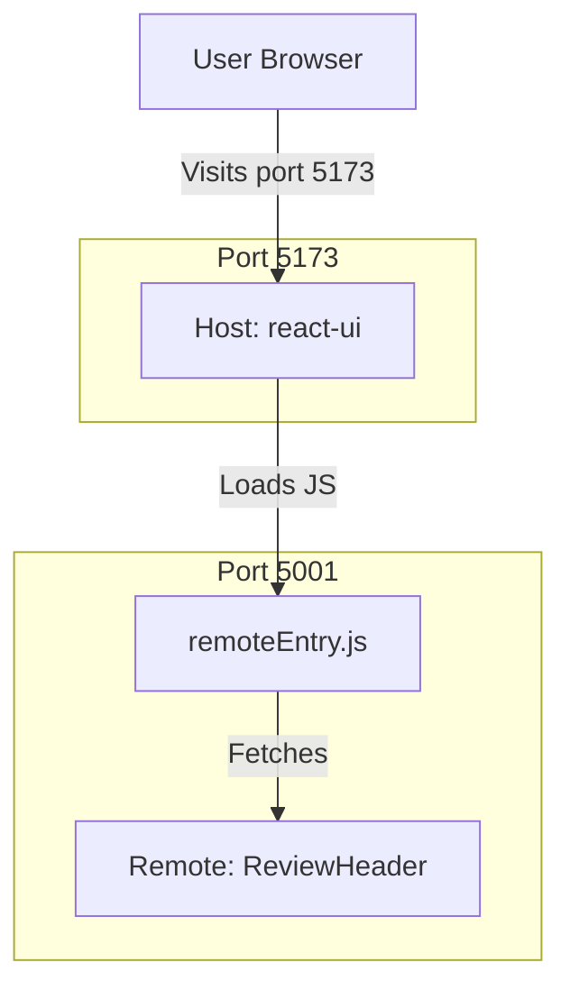

# Micro-Frontends Architecture

This project uses **Module Federation** to split the application into two distinct parts:

1.  **Host App (`react-ui`)**: The main application that the user visits.
2.  **Remote App (`remote-app`)**: A separate application that "exposes" components to the host.

## 1. High-Level Architecture



## 2. Terminology

*   **Host**: The "Consumer". It loads code from other endpoints.
*   **Remote**: The "Provider". It builds specific files (components, logic) into a `remoteEntry.js` file that others can load.
*   **Module Federation**: The technology (via Vite Plugin) that allows sharing code at **runtime**. This means we can update `remote-app` and `react-ui` will see the changes *without* recompiling `react-ui`!

## 3. Configuration Details

### Remote (`remote-app/vite.config.ts`)
We "expose" the component:
```typescript
exposes: {
  './ReviewHeader': './src/components/ReviewHeader.tsx',
}
```

### Host (`react-ui/vite.config.ts`)
We "consume" the remote:
```typescript
remotes: {
  remoteApp: 'http://localhost:5001/assets/remoteEntry.js',
}
```

## 4. How to Run
You must run **both** applications for the federation to work.

1.  **Start Remote** (Terminal 1):
    ```bash
    cd remote-app
    npm run build
    npm run preview -- --port 5001
    ```

2.  **Start Host** (Terminal 2):
    ```bash
    cd react-ui
    npm run dev
    ```

## 5. Summary of Changes
*   **New Project**: Created `remote-app`.
*   **Plugins**: Added `@originjs/vite-plugin-federation` to both.
*   **Code**: Moved `ReviewHeader` logic to `remote-app`.
*   **Wiring**: Updated `react-ui/src/App.tsx` to `lazy` load the header.

## 6. Real World Use Case: "Amazon-style" E-commerce
Imagine an E-commerce site managed by 3 different teams:

1.  **Team Checkout**: Builds the **Cart** and **Checkout** flow. They deploy `checkout-app`.
2.  **Team Discovery**: Builds the **Search** and **Product Details**. They deploy `discovery-app`.
3.  **Team Platform**: Builds the **App Shell** (Header, Footer, Navigation).

With Micro-Frontends (Module Federation):
*   The **App Shell** loads the *Cart Component* from `checkout-app` and puts it in the header.
*   If **Team Checkout** pushes a new "Christmas Color" update to their Cart, the **App Shell** sees it instantly upon refresh.
*   **Benefit**: Team Checkout doesn't need to ask Team Platform to "redeploy" the whole website just to change the Cart button color.

## 7. FAQ: Is this like an Iframe?
**No**, and here is why it is better:

| Feature | Iframe `<iframe>` | Module Federation |
| :--- | :--- | :--- |
| **Technology** | Embeds a completely separate HTML document (Browser inside Browser). | Imports JavaScript code from a network URL. |
| **Memory** | **High**: Loads React/Angular/Vue duplicates for every iframe. | **Low**: Shares a single copy of React (Singleton). |
| **Communication** | **Hard**: Must use `window.postMessage` (slow/complex). | **Seamless**: Just pass `props` like any normal Component! |
| **Styling** | **Isolated**: Hard for Parent to style Child. | **Unified**: CSS can be shared or inherited easily. |
| **Experience** | Can feel clunky (scrollbars inside scrollbars). | Feels like a standard Monolith Single Page App (SPA). |
